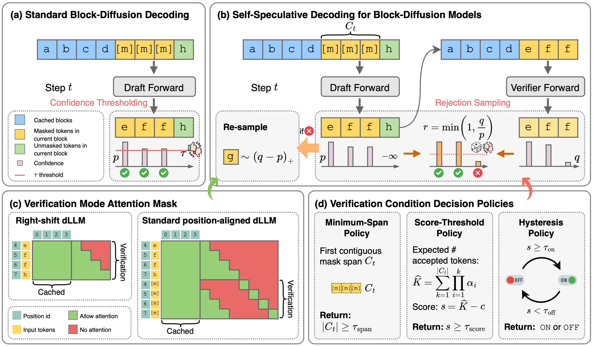

# S2D2: Fast Decoding for Block-Diffusion LLMs via Training-Free Self-Speculation

Code for the [paper](https://arxiv.org/abs/2603.25702).

<p align="center">

</p>

## Overview

Block-diffusion language models offer a promising path toward faster-than-autoregressive generation by combining block-wise autoregressive decoding with within-block parallel denoising. However, in the few-step regime needed for practical acceleration, standard confidence-thresholded decoding is often brittle: aggressive thresholds hurt quality, while conservative thresholds require unnecessary denoising steps. Existing approaches that address this issue either require additional training or incur extra test-time compute.

We present **S2D2**, a training-free self-speculative decoding framework for block-diffusion language models. Our key observation is that a block-diffusion model becomes autoregressive when the block size is reduced to one, allowing the same pretrained model to act as both drafter and verifier. S2D2 inserts a speculative verification step into standard block-diffusion decoding and uses lightweight routing policies to decide when verification is worth its cost. This yields a hybrid decoding trajectory in which diffusion proposes tokens in parallel, while the autoregressive mode acts as a local sequence-level critic.

Across three mainstream block-diffusion families, S2D2 consistently improves the accuracy-speed tradeoff over strong confidence-thresholding baselines. On SDAR, we observe up to **4.7x** speedup over autoregressive decoding, and up to **1.57x** over a tuned dynamic decoding baseline while improving accuracy by up to **4.5** points. On LLaDA2.1-Mini, S2D2 remains complementary to built-in self-correction, including a conservative setting where it is **4.4x** faster than the static baseline with slightly higher accuracy.

## Project Structure

This codebase covers four block-diffusion model families. For each model, we copy the core functionality files into separate subfolders with our modifications. To run experiments, `cd` into the corresponding subfolder.

```
S2D2/
├── SDAR/                  # SDAR-8B-Chat
├── Fast-dLLM-v2/          # Fast-dLLM v2
├── LLaDA2/                # LLaDA2.1-Mini
└── D2F/                   # Discrete Diffusion Forcing
```

## Installation

Please follow each model's official instructions to install required packages. We highlight the following version requirements:

- **SDAR** requires `transformers==4.52.4`. Flash Attention must be installed as:
  ```bash
  pip install "flash-attn==2.7.4.post1" --no-build-isolation --no-cache-dir
  ```
- Other models generally work with a wider range of dependency versions.

## Routing Policies

The following arguments control S2D2's routing policies and are shared across all example and evaluation scripts:

| Argument | Description |
|---|---|
| `--do_verify_policy` | Routing policy: `mask_span_length`, `score_threshold`, `score_hysteresis`, `contextual_bandit_ucb` |
| `--do_verify_score_threshold` | Score threshold $\tau_\text{score}$ |
| `--hysteresis_threshold_on` | Hysteresis upper threshold $\tau_\text{on}$ |
| `--hysteresis_threshold_off` | Hysteresis lower threshold $\tau_\text{off}$ |
| `--do_verify_score_type` | Score type: `difference_static` (static) or `difference_dynamic` (dynamic) |
| `--score_penalty_coef` | Penalty coefficient $c$ |
| `--token_acceptance_estimator` | Estimator type: `soft_entropy_negexp` (soft entropy-based) or `hard_margin_threshold` (hard margin-based) |

## Usage

### SDAR

```bash
cd SDAR

# Standard diffusion decoding
python generate.py

# S2D2 (ours)
CUDA_VISIBLE_DEVICES=0 python generate_ssd_policy.py

# Append --forward_stats to print decoding order and decoded tokens at each step
# Append --draft_ver --cache_ver to enable AR-like caching
CUDA_VISIBLE_DEVICES=0 python generate_ssd_policy.py --forward_stats --draft_ver --cache_ver
```

### Fast-dLLM-v2

```bash
cd Fast-dLLM-v2

# Standard diffusion decoding
python example_v2.py --generate_fn='fast'

# S2D2 (ours)
python example_v2.py --generate_fn='ssd_policy'
```

### LLaDA2.x

```bash
cd LLaDA2

# No-cache version (sample code from the model card, without KV caching)
python example_llada.py --generate_fn='nocache'

# Cached version (our implementation of KV-cached diffusion decoding)
python example_llada.py --generate_fn='cached'

# S2D2 (ours)
python example_llada.py --generate_fn='ssd_policy'
```

### D2F

```bash
cd D2F

python example_d2f.py --generate_fn='d2f'
```

More examples can be found in `D2F/README.md`.

## Configurations used in the paper (main results)

Below are the S2D2 configurations used in our paper for each model family. All configs use `--token_acceptance_estimator soft_entropy_negexp` unless noted otherwise.

### SDAR-8B

| Config | Block Size | Routing Policy | Key Arguments |
|--------|-----------|----------------|---------------|
| Config-A | $B=4$, $S=4$ | Score-threshold ($\tau_\text{score}=0$, static, $c=1$) | `--block_length 4 --denoising_steps 4 --do_verify_policy score_threshold --do_verify_score_threshold 0 --do_verify_score_type difference_static --score_penalty_coef 1 --cache_ver --draft_ver` |
| Config-B | $B=16$, $S=16$ | Always-on verification ($\tau_\text{score}=0$, static, $c=0$) | `--block_length 16 --denoising_steps 16 --do_verify_policy score_threshold --do_verify_score_threshold 0 --do_verify_score_type difference_static --score_penalty_coef 0 --cache_ver --draft_ver` |

Both configs use `--remasking_strategy low_confidence_dynamic --confidence_threshold 0.85`. AR-like caching (`--cache_ver --draft_ver`) is enabled for SDAR.

### Fast-dLLM v2

Base diffusion uses dynamic confidence thresholding with $\tau=0.9$.

| Config | Sub-block Size | Routing Policy | Key Arguments |
|--------|---------------|----------------|---------------|
| Config-A | $\text{SB}=4$ | Hysteresis ($\tau_\text{on}=1$, $\tau_\text{off}=-5$, dynamic, $c=1$) | `--small_block_size 4 --do_verify_policy score_hysteresis --hysteresis_threshold_on 1 --hysteresis_threshold_off -5 --do_verify_score_type difference_dynamic --score_penalty_coef 1` |
| Config-B | $\text{SB}=16$ | Hysteresis ($\tau_\text{on}=1$, $\tau_\text{off}=-5$, dynamic, $c=1$) | `--small_block_size 16 --do_verify_policy score_hysteresis --hysteresis_threshold_on 1 --hysteresis_threshold_off -5 --do_verify_score_type difference_dynamic --score_penalty_coef 1` |
| Config-C | $\text{SB}=32$ | Minimum-span ($\tau_\text{span}=8$) | `--small_block_size 32 --do_verify_policy mask_span_length --min_ssd_span_length 8` |

All configs use `--block_size 32 --threshold 0.9`. AR-like caching is **not** used for Fast-dLLM v2 (`--cache_ver false --draft_ver false`).

### LLaDA2.1-Mini

| Config | Setting | Routing Policy | Key Arguments |
|--------|---------|----------------|---------------|
| Conservative | $\tau_\text{mask}=0.95$, $\tau_\text{edit}=0.9$ | Score-threshold ($\tau_\text{score}=-5$, static, $c=4$) | `--threshold 0.95 --editing_threshold 0.9 --do_verify_policy score_threshold --do_verify_score_threshold -5 --do_verify_score_type difference_static --score_penalty_coef 4` |
| Quality | $\tau_\text{mask}=0.7$, $\tau_\text{edit}=0.5$ | Score-threshold ($\tau_\text{score}=0$, static, $c=4$) | `--threshold 0.7 --editing_threshold 0.5 --do_verify_policy score_threshold --do_verify_score_threshold 0 --do_verify_score_type difference_static --score_penalty_coef 4` |

Both configs use `--block_length 32`. AR-like caching is **not** used for LLaDA2.1-Mini. The Conservative config ($\tau_\text{score}=-5$) triggers verification only when the expected gain is very high, while the Quality config ($\tau_\text{score}=0$) verifies more aggressively.

## Evaluation

### Custom eval scripts

Our custom eval scripts (`eval_gsm8k_*.py`, `eval_mbpp_*.py`, `eval_humaneval_*.py`) are used for:
- **GSM8K**: all models (SDAR, Fast-dLLM v2, LLaDA2.1-Mini)
- **MBPP**: SDAR and LLaDA2.1-Mini
- **HumanEval**: SDAR

All other benchmark/model combinations use `lm-eval-harness` (see below).

**Note on sampling settings:** For historical reasons (default argument inherited from the generate function), SDAR custom eval scripts use `temperature=1.0` with `do_sample=True` for GSM8K, MBPP, and HumanEval. The random seed is fixed to 42 for reproducibility. Fast-dLLM v2 and LLaDA2.1-Mini custom eval scripts use `temperature=0.0` (greedy decoding). For `lm-eval-harness` evaluations, all models use `do_sample=False` (greedy).

### lm-eval-harness

We use a forked version of [lm-evaluation-harness](https://github.com/phymhan/lm-evaluation-harness). Clone the fork and switch to the `more-eval` branch:

```bash
git clone https://github.com/phymhan/lm-evaluation-harness.git
cd lm-evaluation-harness
git checkout more-eval
pip install -e .
```

Use `custom_model_class` to specify a custom modeling file (needed when features like AR-like caching are not supported by the original model), and `custom_generate` to specify the generation function.

**SDAR** (e.g., IFEval):
```bash
cd SDAR
lm_eval --model hf \
  --model_args pretrained=JetLM/SDAR-8B-Chat,trust_remote_code=True,custom_generate=./generate_ssd_policy.py:block_diffusion_generate,block_length=16,denoising_steps=16,remasking_strategy=low_confidence_dynamic,min_ssd_span_length=1,confidence_threshold=0.85,cache_ver=true,draft_ver=true \
  --batch_size 1 \
  --tasks ifeval
```

**Fast-dLLM-v2** (e.g., HumanEval):
```bash
cd Fast-dLLM-v2
HF_ALLOW_CODE_EVAL=1 lm_eval --model hf \
  --model_args pretrained=Efficient-Large-Model/Fast_dLLM_v2_7B,trust_remote_code=True,custom_model_class=./modeling_fast.py:Fast_dLLM_QwenForCausalLM,custom_generate=./generate_policy_utils.py:generate_ssd_policy,block_size=32,small_block_size=32,use_block_cache=false,use_ssd_cache=false,threshold=0.9,cache_ver=false,draft_ver=false,max_new_tokens=512,do_verify_policy=mask_span_length,min_ssd_span_length=8 \
  --batch_size 1 \
  --tasks humaneval \
  --confirm_run_unsafe_code
```

## Citation

```bibtex
@article{han2026s2d2,
  title={Fast Decoding for Diffusion LLMs via Training-Free Self-Speculation},
  author={Han, Ligong and Wang, Hao and Gao, Han and Xu, Kai and Srivastava, Akash},
  journal={arXiv preprint arXiv:2603.25702},
  year={2026}
}
```

## Acknowledgement

Our code borrows heavily from the original codebases:
- **SDAR**: https://github.com/JetAstra/SDAR
- **Fast-dLLM-v2**: https://github.com/NVlabs/Fast-dLLM
- **LLaDA2.x**: https://huggingface.co/inclusionAI/LLaDA2.1-mini
- **D2F**: https://github.com/SJTU-DENG-Lab/Discrete-Diffusion-Forcing

We thank the authors for generously open-sourcing their work!
